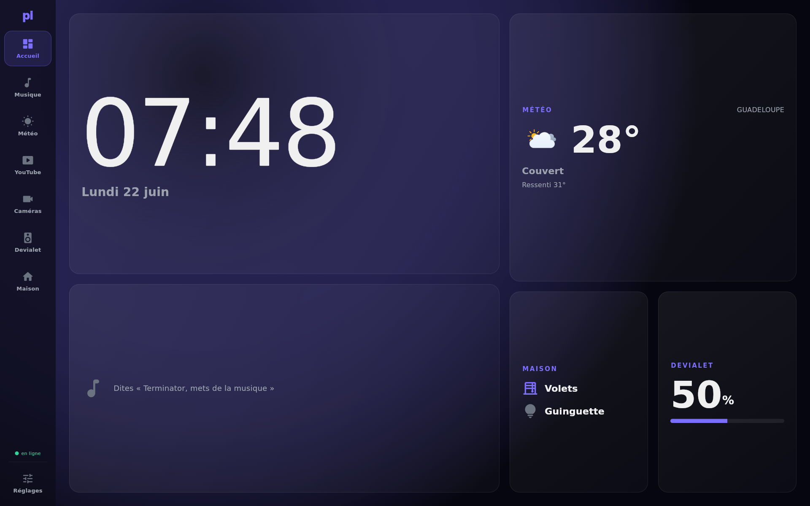
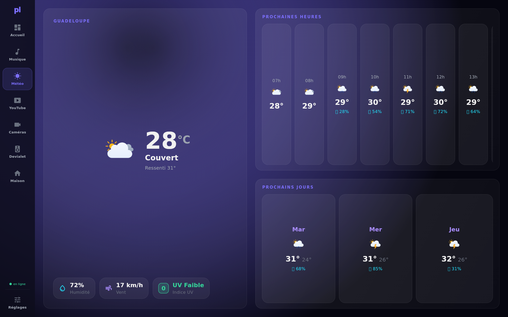
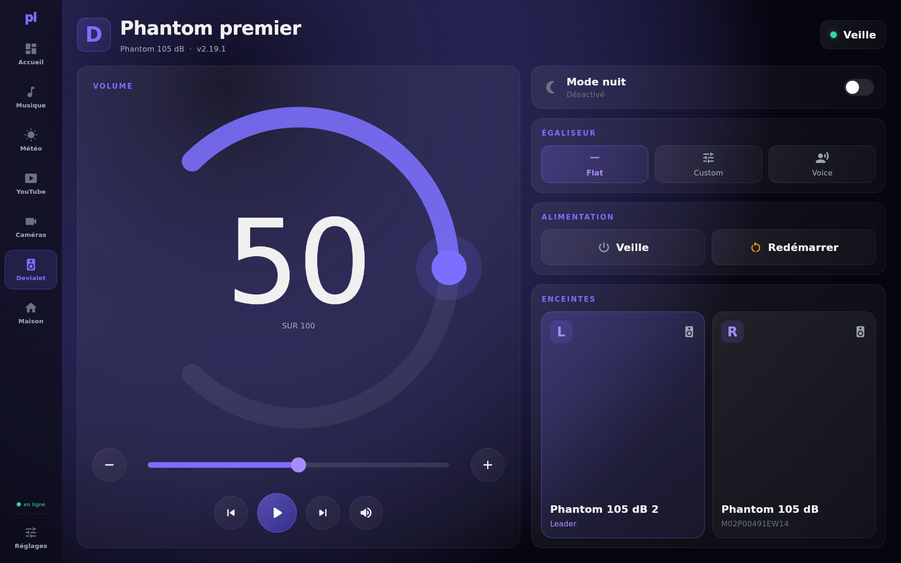
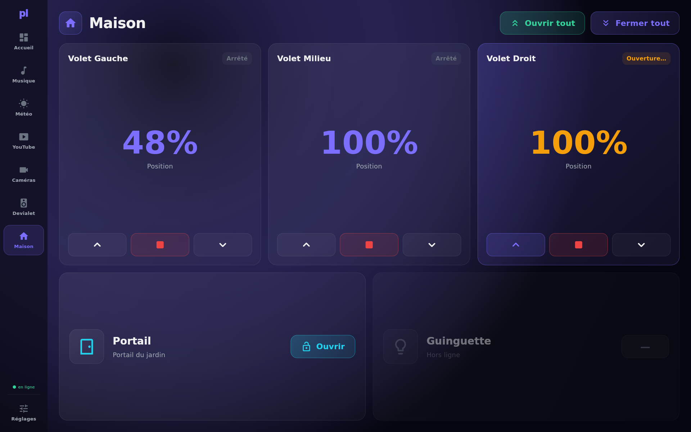
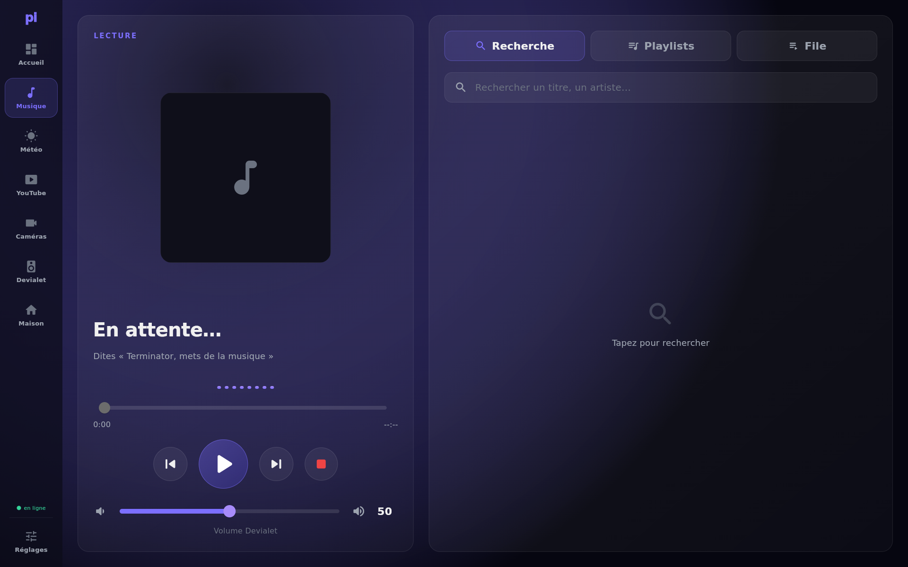

<p align="center">
  
</p>

<h1 align="center">PiBoard</h1>

<p align="center">
  <b>A DIY voice-controlled smart display for your living room — on a Raspberry&nbsp;Pi&nbsp;4.</b><br>
  Local-first&nbsp;· private&nbsp;· open source. A self-hosted alternative to an Echo&nbsp;Show or Nest&nbsp;Hub.
</p>

<p align="center">
  
  
  
  
  
</p>

---

## ✨ What is PiBoard?

PiBoard turns a **Raspberry Pi 4 + an HDMI screen** into a beautiful **voice + touch** smart
display for the living room — meant to be seen from the couch, 2–3&nbsp;m away.

Say the wake word (*"Terminator, mets de la musique"*) or just tap. It plays music, shows the
weather, plays YouTube, streams your cameras, drives your speakers and your smart home — and the
**entire voice pipeline can run 100% locally and for free**: no cloud, no subscription, nothing
leaving your home. Cloud services are an optional fallback, never a requirement.

It's a real, daily-driver project running in a living room in Guadeloupe. The goal of this repo is
to let **you** run your own.

> **Why "PiBoard"?** It's the homemade answer to the Echo Show / Nest Hub: you own the hardware,
> you own the data, and you can change literally anything — it's all here.

---

## 📸 Screenshots

<table>
  <tr>
    <td width="50%"><br><p align="center"><b>Weather</b> — hourly + 3-day, crisp SVG icons</p></td>
    <td width="50%"><br><p align="center"><b>Speakers</b> — volume, EQ, night mode</p></td>
  </tr>
  <tr>
    <td width="50%"><br><p align="center"><b>Home</b> — shutters, gate, smart plugs</p></td>
    <td width="50%"><br><p align="center"><b>Music</b> — radio, library, Spotify, Deezer</p></td>
  </tr>
</table>

---

## 🎯 Features

- 🗣️ **Voice assistant** — wake word → speech-to-text → intent/LLM → action → text-to-speech.
  A fast keyword router handles common commands with **zero LLM calls**; the LLM only answers
  open questions.
- 🎵 **Music** — internet **radio** (free, no account, the default), a **local library**, **Spotify**,
  or **Deezer** (opt-in). One clean provider interface.
- 🌤️ **Weather** — [Open-Meteo](https://open-meteo.com/) (no API key), current + hourly + 3-day,
  with beautiful [Meteocons](https://github.com/basmilius/weather-icons) SVG icons.
- 📺 **YouTube** — search and play, hardware-decoded **in-app** (no Chromium).
- 📷 **Cameras** — live snapshots & MJPEG streams (UniFi Protect).
- 🔊 **Speakers** — Devialet Phantom control over IP (volume, EQ, night mode) + AirPlay output.
- 🏠 **Home automation** — Shelly (Gen 1/2/3) & TP-Link Kasa out of the box, **or** plug into your
  existing **Home Assistant**. Devices live in config — no code changes.
- 🎨 **Native, themeable, bilingual** — a native [flutter-pi](https://github.com/ardera/flutter-pi)
  UI (no web browser), **🇫🇷/🇬🇧 FR/EN**, **rebrandable colors without recompiling**, and
  **resolution-independent** (runs on any landscape screen).
- 🔒 **Local-first & private** — the whole voice loop can run on your own hardware; cloud is optional.
- ⚙️ **Web admin panel** — configure everything from your phone/browser.

---

## 🧠 The voice pipeline

```
wake word ──▶ speech-to-text ──▶ intent / LLM ──▶ action ──▶ text-to-speech ──▶ speakers
```

Every stage is swappable, local **or** cloud:

| Stage          | Local (free)                                   | Cloud (optional fallback) |
|----------------|------------------------------------------------|---------------------------|
| Wake word      | [livekit-wakeword](https://pypi.org/project/livekit-wakeword/) (trained model) | — |
| Speech-to-text | **Vosk** (offline) · Nemotron ASR (LAN)        | Voxtral (Mistral)         |
| LLM            | **Ollama** (e.g. Qwen) via a tiny LAN gateway  | Mistral                   |
| Text-to-speech | **Piper** (offline) · Voxtral MLX (LAN)        | Voxtral (Mistral)         |

Pick *all-local* (zero cost, fully private), *Pi + a LAN helper machine* (a Mac/PC running Ollama),
or *cloud* — it's a couple of `.env` switches.

---

## 🏗️ Architecture

```
┌──────────────────────── Raspberry Pi 4 ────────────────────────┐
│  flutter-pi UI  ⇄  WebSocket  ⇄  FastAPI backend (Python)       │
│      (native, HDMI)                 │                           │
│                       mic ▶ wake ▶ STT ▶ intent ▶ action ▶ TTS  │
│                                     │  music · weather · video  │
│                                     │  cameras · speakers · home │
└──────────────────────────┬─────────────────────────┬───────────┘
                  optional LAN AI helper         AirPlay / speakers
                  (Ollama + TTS over HTTP)
```

- **UI** — `frontend-flutter/` (native flutter-pi, no Chromium).
- **Backend** — `backend/` (FastAPI/asyncio); every service is *zero-crash* (degrade, never take down the loop).
- **Admin web** — `frontend/admin/` (Svelte).
- **LAN AI gateway** — `lan-voice-gateway/` (optional; wraps Ollama + a local TTS so the Pi stays light).

---

## 🛠️ Hardware

| Part | Notes |
|------|-------|
| **Raspberry Pi 4** (4 GB+) | Bookworm 64-bit |
| **HDMI display** | designed for **1920×1200 landscape**; scales to any landscape resolution |
| **USB microphone** | a far-field array (e.g. ReSpeaker) works best |
| **Speakers** | anything PipeWire can reach — AirPlay, HDMI, Bluetooth, jack… (Devialet Phantom gets extra IP control) |
| *(optional)* a LAN machine | any PC/Mac to run Ollama + local TTS for the free LLM/voice path |

---

## 🚀 Quick start

```bash
git clone https://github.com/elkir0/PiBoard.git
cd PiBoard

# 1) Configure (everything is optional — empty = feature disabled, cleanly)
cp .env.example .env        # set your weather location, integrations, etc.

# 2) Backend
cd backend
python3 -m venv venv && source venv/bin/activate
pip install -r requirements.txt
python main.py              # serves the API + admin on :8000

# 3) UI (build the flutter-pi bundle on a dev machine, deploy to the Pi)
#    see scripts/deploy-flutter-v3.sh
```

Then open the **admin panel** at `http://<pi>:8000/admin/` (a random admin password is generated and
printed in the log on first run). The minimum to get going is a weather location and a reachable
audio output — everything else is progressive.

> 📜 Full configuration reference: [`.env.example`](.env.example).
> 🗺️ Where the project is heading: see the [Roadmap](#-roadmap) below.

---

## 🧩 Tech stack

**Flutter** (flutter-pi, native ARM, no browser) · **Python** (FastAPI + asyncio) · **Svelte** (admin) ·
**PipeWire** audio · **Vosk / Piper / Ollama / Voxtral** for the local voice stack.

## 🔒 A note on Deezer

Deezer support is **opt-in** and uses a personal ARL token (a grey area of Deezer's ToS — personal use,
no stream archiving). **No credentials ship in this repo**; you provide your own. The legal default is
free internet radio. Use it responsibly.

## 🗺️ Roadmap

Shipped recently: legal-by-default music, full FR/EN localization, runtime theming, a pluggable
home-automation layer (Shelly/Kasa **or** Home Assistant), and resolution-independent layouts.

Next up:

- 🧙 **First-run setup wizard** — guided onboarding so non-developers can configure everything from the browser.
- 🎧 **Spotify Connect** (librespot) as a first-class music source.
- 📱 **Portrait & adaptive layouts** — full reflow for portrait screens and an adaptive nav rail.
- 🏠 **Deeper Home Assistant integration** — a fully data-driven home page from your HA entities.
- 🗣️ **More wake words & languages** — bring-your-own hotword, additional UI locales.

## 🤝 Contributing

Issues and PRs welcome. The project values **simplicity over cleverness** — each component as small and
readable as possible, every service fails soft. Pick anything from the roadmap, or scratch your own itch.

## 📄 License

[MIT](LICENSE) — do what you like, no warranty.

---

<p align="center"><sub>Built and maintained with the help of Claude Code. Made for a real living room. 🛋️</sub></p>
